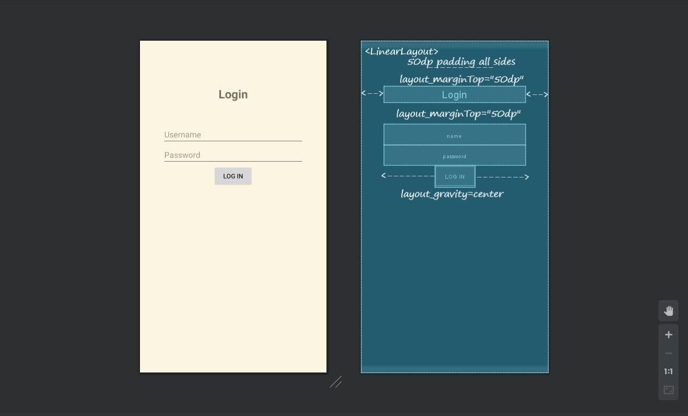
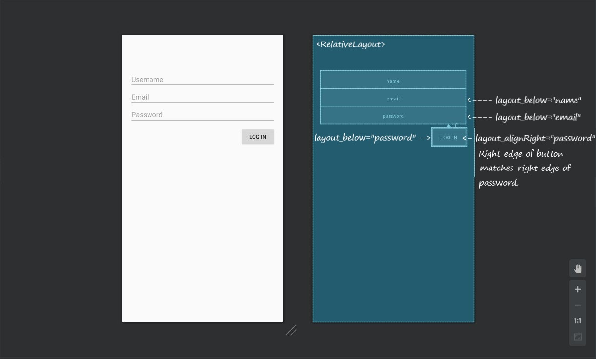
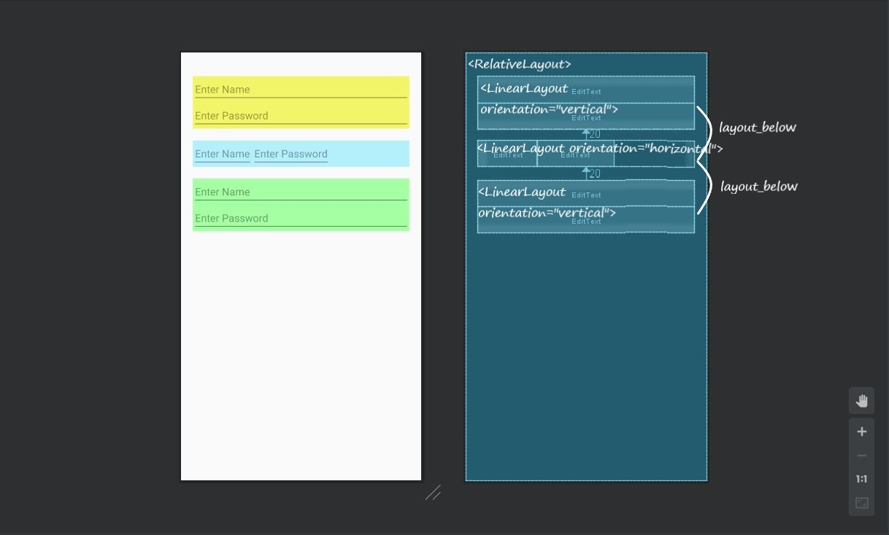

# Linear and Relative Layouts --Examples

### Linear Layouts
<a href="https://developer.android.com/reference/android/widget/LinearLayout.LayoutParams">Docs</a>

### Relative Layouts
<a href="https://developer.android.com/reference/android/widget/RelativeLayout.LayoutParams">Docs</a>

### Nested Layout

